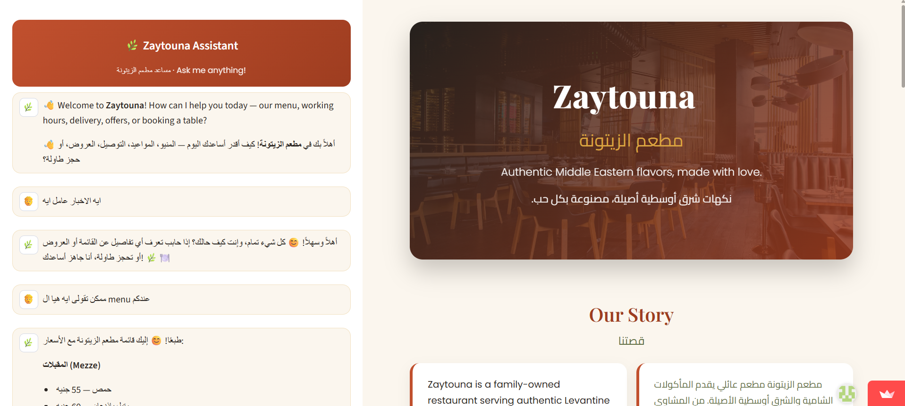
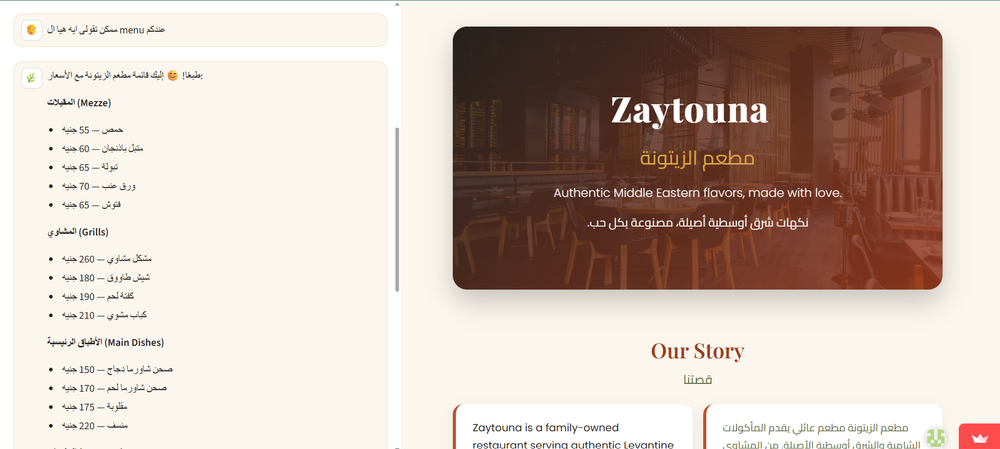
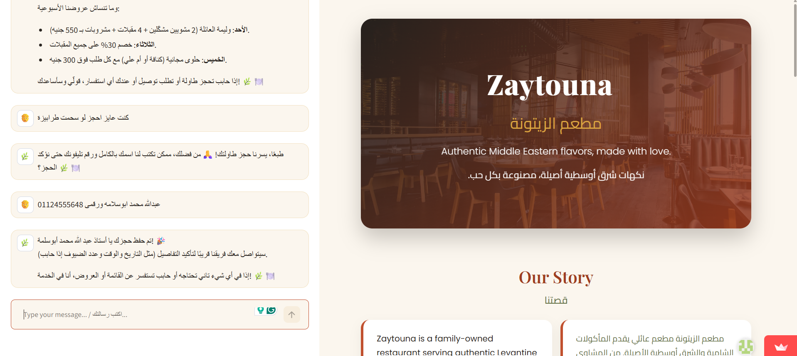
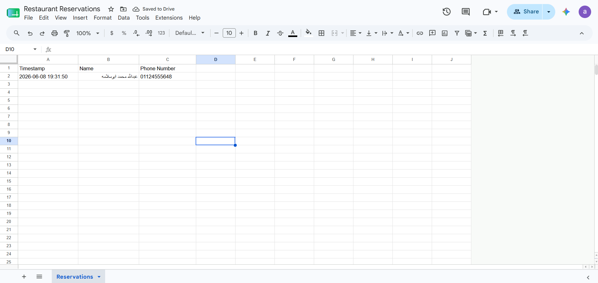

# 🌿 Restaurant AI Chatbot Website / موقع مطعم بمساعد ذكي

A simple, beautiful web app for a restaurant: a modern landing page **plus an AI
assistant** that chats with customers (in Arabic & English), answers their
questions, and **automatically saves reservations into Google Sheets**.

> Built with **Python · Streamlit · Groq · Google Gemini · Google Sheets**.

---

## 📸 Screenshots

| Landing page + AI assistant | Assistant answering about the menu |
|:---:|:---:|
|  |  |
| **Capturing a reservation in chat** | **Reservation saved to Google Sheets** |
|  |  |

---

## ✨ What it does
- A welcoming, food-themed restaurant landing page (menu, hours, location, offers, delivery).
- A built-in **AI assistant** in the sidebar that answers customer questions naturally,
  in whichever language they write in (Arabic or English).
- **Smart safety / fallback:** it always tries the primary AI provider first (**Groq**),
  and if a model is busy or fails, it **instantly and automatically** falls back to the
  next model — and finally to **Google Gemini** — so the customer never sees an error.
- **Automatic reservations:** when a customer wants to book a table or leave their
  details, the assistant collects their **Name + Phone Number** and appends a row
  (`Timestamp, Name, Phone Number`) into a **Google Sheet**.

## 📁 Project structure
| File | Purpose |
|------|---------|
| `app.py` | The website + sidebar chat (Streamlit UI). |
| `chatbot.py` | The AI brain: provider/model **fallback chain** + reservation capture. |
| `sheets.py` | Saves reservations into Google Sheets. |
| `content.json` | **All restaurant info — name, menu, hours, offers, contact. Edit this to customise.** |
| `restaurant_data.py` | Loads `content.json` and builds the assistant's knowledge/persona. |
| `config.py` | Loads settings securely from `.env`. |
| `requirements.txt` | Python dependencies. |
| `.env.example` | Template for your private settings — copy it to `.env`. |
| `.streamlit/config.toml` | Forces a consistent light theme. |
| `run.bat` / `run.sh` | One-click launchers (Windows / Mac-Linux). |

> **Note:** `content.json` ships with **sample/demo data** (a fictional restaurant
> called *Zaytouna* with placeholder address and phone). Replace it with your own
> details — see *Customising* below.

---

## 🔑 Configuration (required)

The app reads all secrets from a local `.env` file, which is **never committed to git**.
Copy the template and fill in your own values:

```bash
cp .env.example .env      # Windows: copy .env.example .env
```

Then open `.env` and set at least one AI provider key:

| Variable | What it's for | Where to get it |
|----------|---------------|-----------------|
| `GROQ_API_KEY` | Primary AI provider (fast, free, good Arabic + tool calling) | https://console.groq.com/keys |
| `GEMINI_API_KEY` | Fallback AI provider (optional) | https://aistudio.google.com/ |
| `GOOGLE_SHEET_ID` | The Sheet where reservations are saved (optional) | The code in your sheet URL between `/d/` and `/edit` |
| `GOOGLE_CREDENTIALS_FILE` | Path to your Google service-account JSON | https://console.cloud.google.com/ |

The website runs without any keys, but the assistant stays disabled until at least one
of `GROQ_API_KEY` or `GEMINI_API_KEY` is set. Reservations are only saved when
`GOOGLE_SHEET_ID` **and** a valid `credentials.json` are both present.

> ⚠️ Never commit `.env` or `credentials.json` — they are listed in `.gitignore`.

---

## 🚀 Run locally

**Option A — one-click launcher** (creates the virtual environment and installs
dependencies automatically):
- **Windows:** double-click **`run.bat`**.
- **Mac / Linux:** `bash run.sh`.

**Option B — manual:**
```bash
python -m venv .venv
# Windows:  .venv\Scripts\activate
# Mac/Linux: source .venv/bin/activate
pip install -r requirements.txt
streamlit run app.py
```

Your browser opens the website automatically. Requires **Python 3.10+**.

---

## 🎨 Customising the restaurant (no coding)
All text, menu items, prices, hours, offers, and contact details live in one file:
**`content.json`**. Open it in any text editor, change the text between the quotation
marks, and save. Only edit the text inside `"..."` — keep the commas, brackets, and
quotes as they are. (Tip: paste your file into [jsonlint.com](https://jsonlint.com) to
confirm it's valid.) If the file ever has a typo, the app safely falls back to built-in
default text instead of breaking.

---

## ☁️ Deploy online (Streamlit Community Cloud)
1. Push this repo to **GitHub** (keep `.env` and `credentials.json` **out** of GitHub —
   they're already in `.gitignore`).
2. Go to **[share.streamlit.io](https://share.streamlit.io/)**, connect the repo, and
   pick `app.py`.
3. In the app's **Settings → Secrets**, add your keys (`GROQ_API_KEY`, optionally
   `GEMINI_API_KEY`, `GOOGLE_SHEET_ID`) and, for reservations, the full contents of your
   service-account JSON. Streamlit Secrets replace the local `.env` / credentials files.
4. Deploy → you get a public link to share, and reservations flow into your Google Sheet.

---

## 📝 License
Released for educational/portfolio use. Replace the demo content in `content.json` with
your own before deploying publicly.

---

# 🇸🇦 دليل سريع بالعربية

موقع مطعم بسيط وأنيق مع **مساعد ذكي** يردّ على العملاء بالعربية والإنجليزية، ويجاوب على
أسئلتهم، **ويحفظ الحجوزات تلقائياً في Google Sheets**.

**التشغيل:**
1. انسخ ملف الإعدادات: `cp .env.example .env` ثم افتح `.env` وأضف مفتاح `GROQ_API_KEY`
   (احصل عليه مجاناً من https://console.groq.com/keys).
2. شغّل التطبيق: في ويندوز اضغط مرّتين على **`run.bat`**، وفي ماك/لينكس نفّذ `bash run.sh`.
3. سيفتح الموقع تلقائياً في المتصفح.

**التخصيص:** كل بيانات المطعم (الاسم، المنيو، الأسعار، المواعيد، العروض، التواصل) موجودة
في ملف **`content.json`**. عدّل النصوص بين علامات التنصيص فقط واترك الفواصل والأقواس كما هي.

> ⚠️ لا ترفع ملفّي `.env` و `credentials.json` على GitHub — فهما يحتويان على مفاتيحك السرية
> (وهما مستثنيان أصلاً في `.gitignore`).
